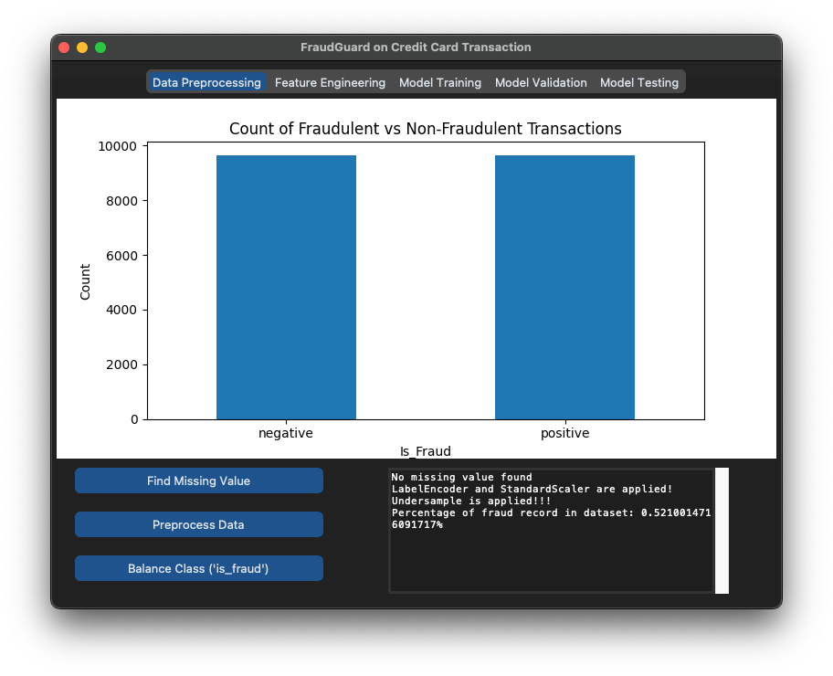

# 🚨 FraudGuard: Credit Card Fraud Detection 🚨

## Project Overview 🎯
Welcome to the **FraudGuard** project! Our mission is to detect fraudulent credit card transactions using cutting-edge machine learning techniques. Join us on this exciting journey as we uncover the secrets behind suspicious activities and keep your money safe!

## Flowchart of the System


The flowchart illustrates the architecture and workflow of the FraudGuard credit card fraud detection system. It outlines the key stages, including data preprocessing, feature selection, model training, evaluation, and user interaction. Each component is designed to ensure a seamless experience for users while effectively detecting fraudulent transactions through advanced machine learning techniques.

## Key Features 🔑

- **Efficient Data Preprocessing**: 
  - The application handles missing values, class imbalance, and feature encoding to prepare the data for modeling.

- **Intuitive Feature Selection**: 
  - Users can easily select relevant features for model training based on their domain knowledge and the correlation between features.

- **Robust Model Training**: 
  - The project employs logistic regression, a widely used algorithm for binary classification tasks, to train the fraud detection model.

- **Comprehensive Model Evaluation**: 
  - The application provides detailed performance metrics, including confusion matrix and classification report, to assess the model's effectiveness.

- **User-Friendly Interface**: 
  - The project features a clean and interactive graphical user interface (GUI) built using the CustomTkinter library, making it accessible to users with varying technical backgrounds.

## User Interface Overview 🌐
The FraudGuard application features a user-friendly interface designed to facilitate the entire process of fraud detection. Below are the key components of the interface:

### Data Preprocessing Tab 🧹
<div style="flex: 50%; padding: 10px; text-align: center;">
    
  </div>

- **Objective**: Understand the distribution of fraudulent and non-fraudulent records.
- **Functionality**: Visualize the number of "not_fraud" and "fraud" records through a graph after undersampling. This helps in assessing the balance of the dataset before proceeding with further analysis.


### Feature Engineering Tab 🔍
<div style="flex: 50%; padding: 10px; text-align: center;">
    
  </div>
  
- **Objective**: Select relevant features for model training.
- **Functionality**: Users can choose features from a list of checkboxes. Once selected, the application displays the correlation between these features on a graph, allowing users to make informed decisions about which features to include in the model.

### Model Training Tab 🏋️‍♀️
<div style="flex: 50%; padding: 10px; text-align: center;">
    
  </div>

- **Objective**: Prepare and train the model.
- **Functionality**: The data is split into three groups: training, validation, and testing. The application combines the "not_fraud" and "fraud" datasets to form the final three groups. It separates the target column from the dataset and trains the model using logistic regression, ensuring a robust training process.

### Model Validation and Testing Tab 🧪
<div style="flex: 50%; padding: 10px; text-align: center;">
    
  </div>

- **Objective**: Validate and test the trained model.
- **Functionality**: The application displays a confusion matrix using a heatmap, providing a visual representation of the model's performance. Additionally, it generates a classification report in a textbox, summarizing the model's accuracy and effectiveness.

## Project Structure
```bash
FraudDetection/
│
├── main.py 🚀
├── src/
│ ├── data_preprocessing.py 🧹
│ ├── feature_engineering.py 🔍
│ ├── model_training.py 🏋️‍♀️
│ └── model_evaluation.py 🧪
├── model/                    
│   ├── logistic_regression_model.joblib  # Saved ML models in .joblib format
│   └── selected_features.txt              # File containing selected features
├── util/
│ └── azure_connection.py 🌐
├── data/
│ └── combine.csv.zip  🔀
└── notebooks/
  └── data_exploration.ipynb 🔍
  ```


## Files and Their Superpowers 💫
- **main.py**: The main entry point of the application. It initializes the user interface and orchestrates the workflow of the project.

- **src/**: This directory contains the core functionalities of the project.
  - **data_preprocessing.py**: Handles data cleaning, missing value treatment, and data preprocessing steps such as encoding and scaling.
  - **feature_engineering.py**: Responsible for selecting features for the model training phase.
  - **model_training.py**: Contains functions for splitting the data, preparing it for training, and training the logistic regression model.
  - **model_evaluation.py**: Evaluates the trained model using confusion matrix and classification report.

- **model/**: Contains saved machine learning models in .joblib format.
  - The directory supports versioning by saving models incrementally (e.g., logistic_regression_model.joblib, logistic_regression_model_1.joblib).

- **util/**: Contains utility functions for connecting to Azure and managing data storage.
  - **azure_connection.py**: Functions to connect to Azure services and handle data operations.

- **data/**: This folder contains the datasets used in the project.
  - **combine.csv.zip**: A combined dataset for training and testing.

- **notebooks/**: Contains Jupyter notebooks for data exploration and analysis.
  - **data_exploration.ipynb**: Notebook for exploring the dataset, visualizing data distributions, and understanding relationships between features.

## Getting Started 🚀

1. **Optional**: Create Virtual Environment:
```bash
python -m venv myenv
source <path to your folder>/p_FraudGuard/myenv/bin/activate
```

2. **Setup**: Ensure you have the required libraries installed. You can install them using pip:
```bash
pip install -r requirements.txt
```

3. **Unzipping** the Data: Navigate to the data folder and unzip the combine.csv.zip file. You can do this using the following command in your terminal:
```bash
unzip data/combine.csv.zip -d data/
```

4. **Create the .env File**: In the root directory of your project, create a .env file. You can do this using a text editor or by running the following command:
```bash
touch .env
```

5. **Assign CSV File Path**: Open the .env file and add the following line to assign the path of the combine.csv file to the your_csv_directory variable:
```text
your_csv_directory= "data/combine.csv"
```

6. **Run the Application**: Execute the main.py file to start the application:
```bash
python main.py
```

## Cloning the Repository 🚀

To clone the **FraudGuard** project to your local machine, follow these steps:
1. **Open Your Terminal**:
   - On Windows, you can use Git Bash or Command Prompt.
   - On macOS, open the Terminal application.

2. **Navigate to Your Desired Directory**:
   - Use the `cd` command to change to the directory where you want to clone the repository. For example:
     ```bash
     cd path/to/your/directory
     ```

3. **Run the Clone Command**:
   - Type the following command and paste the URL you copied from GitHub:
     ```bash
     git clone https://github.com/Kpn23/FraudGuard.git
     ```

4. **Press Enter**:
   - This will create a local copy of the repository on your machine, including all files, branches, and commit history.


## Dataset Source 📊
This project utilizes the Credit Card Transactions Fraud Detection Dataset, which is available on [Kaggle](https://www.kaggle.com/datasets/kartik2112/fraud-detection).

### Dataset Schema 

The dataset used in the FraudGuard project contains **2,593,350 entries** with a total of **23 columns**. Each column is detailed below:

| Column Name                  | Data Type | Description                                         |
|------------------------------|-----------|-----------------------------------------------------|
| **id**                       | int64     | Unique identifier for each transaction              |
| **trans_date_trans_time**   | object    | Date and time of the transaction                    |
| **cc_num**                  | int64     | Credit card number associated with the transaction   |
| **merchant**                 | object    | Name of the merchant where the transaction occurred  |
| **category**                 | object    | Category of the merchant (e.g., grocery, retail)    |
| **amt**                      | float64   | Amount of the transaction                            |
| **first**                    | object    | First name of the cardholder                        |
| **last**                     | object    | Last name of the cardholder                         |
| **gender**                   | object    | Gender of the cardholder                            |
| **street**                   | object    | Street address of the cardholder                    |
| **city**                     | object    | City where the cardholder resides                   |
| **state**                    | object    | State where the cardholder resides                  |
| **zip**                      | int64     | Zip code of the cardholder's address                |
| **lat**                      | float64   | Latitude of the cardholder's location               |
| **long**                     | float64   | Longitude of the cardholder's location              |
| **city_pop**                 | int64     | Population of the city where the cardholder resides  |
| **job**                      | object    | Job title of the cardholder                         |
| **dob**                      | object    | Date of birth of the cardholder                     |
| **trans_num**                | object    | Transaction number                                   |
| **unix_time**               | int64     | Unix timestamp of the transaction                    |
| **merch_lat**                | float64   | Latitude of the merchant's location                 |
| **merch_long**              | float64   | Longitude of the merchant's location                |
| **is_fraud**                | int64     | Indicator of whether the transaction is fraudulent (1 for yes, 0 for no) |
