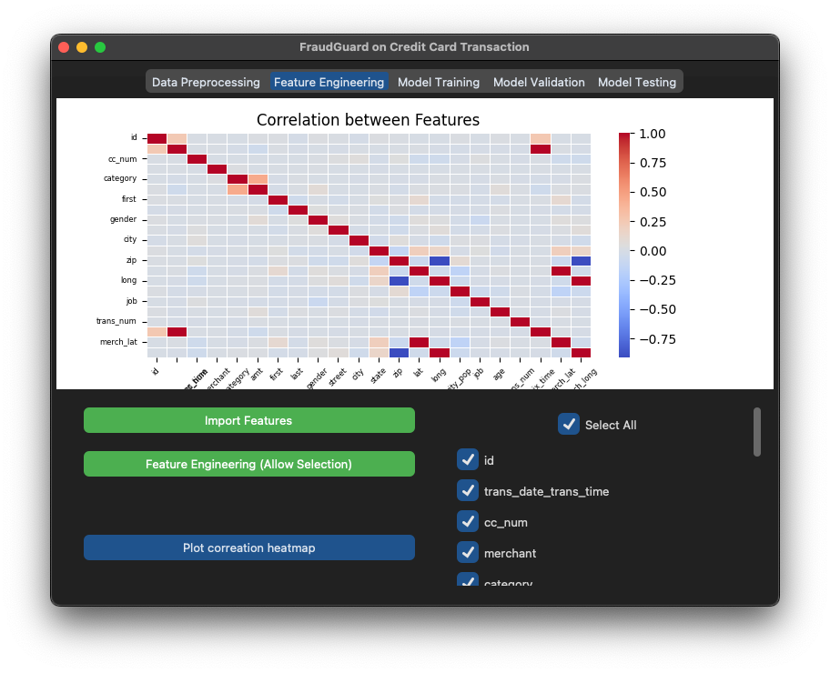
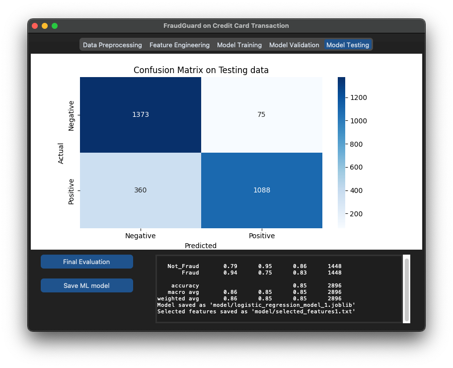

# 🚨 FraudGuard: Credit Card Fraud Detection 🚨

### Project Overview 🎯
Welcome to the FraudGuard project! Our mission is to detect fraudulent credit card transactions using cutting-edge machine learning techniques. Join us on this exciting journey as we uncover the secrets behind suspicious activities and keep your money safe!

## User Interface Overview 🌐
The FraudGuard application features a user-friendly interface designed to facilitate the entire process of fraud detection. Below are the key components of the interface:

### Data Preprocessing Tab 🧹
<div style="flex: 50%; padding: 10px; text-align: center;">
    
  </div>

- **Objective**: Understand the distribution of fraudulent and non-fraudulent records.
- **Functionality**: Visualize the number of "not_fraud" and "fraud" records through a graph after undersampling. This helps in assessing the balance of the dataset before proceeding with further analysis.


### Feature Engineering Tab 🔍
<div style="flex: 50%; padding: 10px; text-align: center;">
    
  </div>
  
- **Objective**: Select relevant features for model training.
- **Functionality**: Users can choose features from a list of checkboxes. Once selected, the application displays the correlation between these features on a graph, allowing users to make informed decisions about which features to include in the model.

### Model Training Tab 🏋️‍♀️
<div style="flex: 50%; padding: 10px; text-align: center;">
    
  </div>

- **Objective**: Prepare and train the model.
- **Functionality**: The data is split into three groups: training, validation, and testing. The application combines the "not_fraud" and "fraud" datasets to form the final three groups. It separates the target column from the dataset and trains the model using logistic regression, ensuring a robust training process.

### Model Validation and Testing Tab 🧪
<div style="flex: 50%; padding: 10px; text-align: center;">
    
  </div>

- **Objective**: Validate and test the trained model.
- **Functionality**: The application displays a confusion matrix using a heatmap, providing a visual representation of the model's performance. Additionally, it generates a classification report in a textbox, summarizing the model's accuracy and effectiveness.

## Project Structure
```bash
FraudDetection/
│
├── main.py 🚀
├── src/
│ ├── data_preprocessing.py 🧹
│ ├── feature_engineering.py 🔍
│ ├── model_training.py 🏋️‍♀️
│ └── model_evaluation.py 🧪
├── util/
│ └── azure_connection.py 🌐
├── data/
│ └── combine.csv.zip  🔀
└── notebooks/
  └── data_exploration.ipynb 🔍
  ```


## Files and Their Superpowers 💫
- **main.py**: The main entry point of the application. It initializes the user interface and orchestrates the workflow of the project.

- **src/**: This directory contains the core functionalities of the project.
  - **data_preprocessing.py**: Handles data cleaning, missing value treatment, and data preprocessing steps such as encoding and scaling.
  - **feature_engineering.py**: Responsible for selecting features for the model training phase.
  - **model_training.py**: Contains functions for splitting the data, preparing it for training, and training the logistic regression model.
  - **model_evaluation.py**: Evaluates the trained model using confusion matrix and classification report.

- **util/**: Contains utility functions for connecting to Azure and managing data storage.
  - **azure_connection.py**: Functions to connect to Azure services and handle data operations.

- **data/**: This folder contains the datasets used in the project.
  - **combine.csv.zip**: A combined dataset for training and testing.

- **notebooks/**: Contains Jupyter notebooks for data exploration and analysis.
  - **data_exploration.ipynb**: Notebook for exploring the dataset, visualizing data distributions, and understanding relationships between features.

## Getting Started 🚀

1. **Setup**: Ensure you have the required libraries installed. You can install them using pip:
```bash
pip install -r requirements.txt
```

2. **Unzipping** the Data: Navigate to the data folder and unzip the combine.csv.zip file. You can do this using the following command in your terminal:
```bash
unzip data/combine.csv.zip -d data/
```

3. **Create the .env File**: In the root directory of your project, create a .env file. You can do this using a text editor or by running the following command:
```bash
touch .env
```

4. **Assign CSV File Path**: Open the .env file and add the following line to assign the path of the combine.csv file to the your_csv_directory variable:
```text
your_csv_directory= "data/combine.csv"
```

5. **Run the Application**: Execute the main.py file to start the application:
```bash
python main.py
```

## Dataset Source 📊
This project utilizes the Credit Card Transactions Fraud Detection Dataset, which is available on [Kaggle](https://www.kaggle.com/datasets/kartik2112/fraud-detection).